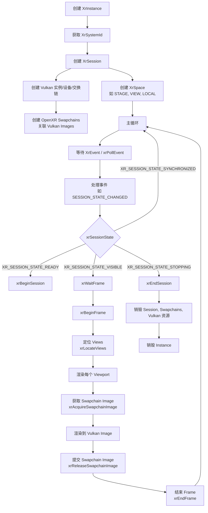
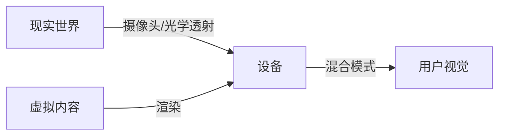
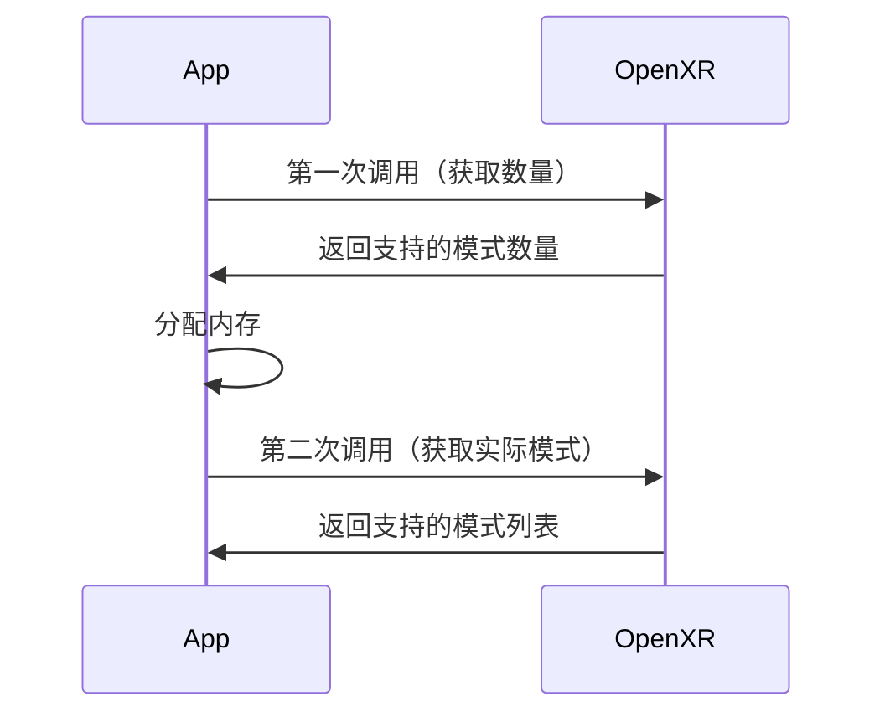
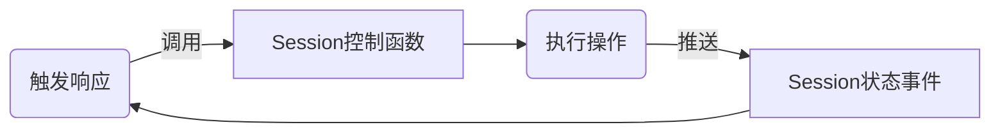
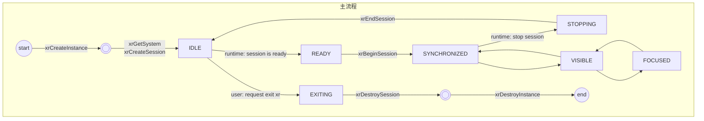
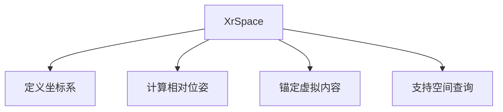
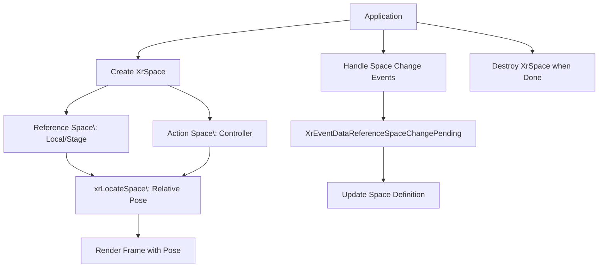
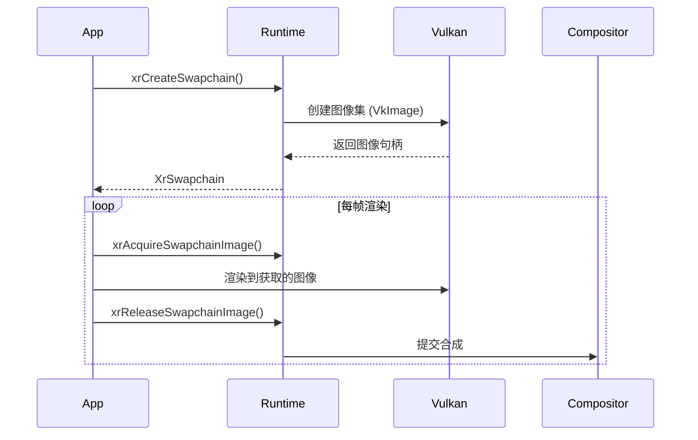
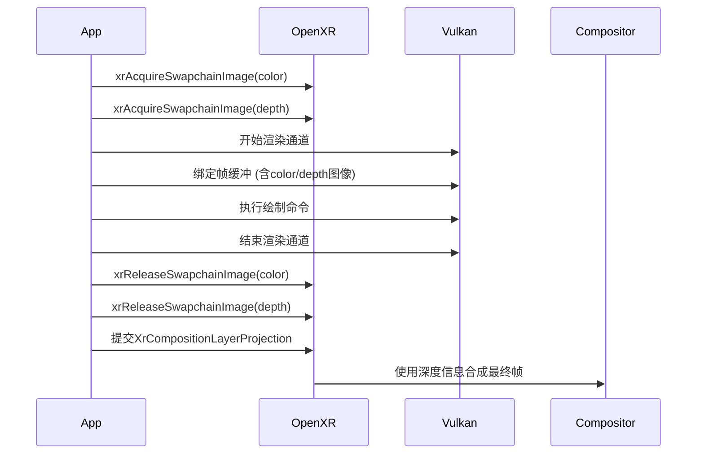

# OpenXR概念

**目录**

- [OpenXR概念](#openxr概念)
    - [主要概念](#主要概念)
    - [OpenXR一般工作流程](#openxr一般工作流程)
    - [API Layer](#api-layer)
        - [一、API Layer 是什么？](#一api-layer-是什么)
        - [二、核心作用](#二核心作用)
        - [三、为什么需要 API Layer？技术必要性](#三为什么需要-api-layer技术必要性)
        - [四、工作流程与关键技术点](#四工作流程与关键技术点)
        - [五、典型应用场景](#五典型应用场景)
        - [六、注意事项与常见问题](#六注意事项与常见问题)
        - [总结](#总结)
    - [SystemId](#systemid)
        - [一、SystemId的定义与作用](#一systemid的定义与作用)
        - [二、如何获取SystemId？](#二如何获取systemid)
        - [三、SystemId与系统唯一标识的区别](#三systemid与系统唯一标识的区别)
        - [四、实际应用场景](#四实际应用场景)
        - [五、常见问题](#五常见问题)
    - [ViewConfigurationType 详解](#viewconfigurationtype-详解)
        - [一、什么是 ViewConfigurationType？](#一什么是-viewconfigurationtype)
        - [二、核心作用](#二核心作用-1)
        - [三、实际应用场景](#三实际应用场景)
        - [四、重要注意事项](#四重要注意事项)
        - [总结](#总结-1)
    - [EnvironmentBlendMode - 环境混合模式](#environmentblendmode---环境混合模式)
        - [一、EnvironmentBlendMode 是什么？](#一environmentblendmode-是什么)
        - [二、EnvironmentBlendMode 的三种主要类型](#二environmentblendmode-的三种主要类型)
        - [三、混合模式选择策略](#三混合模式选择策略)
        - [总结](#总结-2)
    - [XrSession](#xrsession)
        - [一、Session的核心作用](#一session的核心作用)
        - [二、Session状态机（关键生命周期）](#二session状态机关键生命周期)
        - [三、基本用法](#三基本用法)
    - [OpenXR 空间系统深度解析：XrSpace、参考空间与生命周期](#openxr-空间系统深度解析xrspace参考空间与生命周期)
        - [一、XrSpace 的本质与作用](#一xrspace-的本质与作用)
        - [二、参考空间 (Reference Spaces)](#二参考空间-reference-spaces)
        - [三、动作空间（Action Space）](#三动作空间action-space)
        - [四、XrSpace生命周期](#四xrspace生命周期)
    - [OpenXR 交换链深度解析：颜色与深度交换链在 Vulkan 中的协同作用](#openxr-交换链深度解析颜色与深度交换链在-vulkan-中的协同作用)
        - [一、交换链基础概念](#一交换链基础概念)
        - [二、颜色交换链 (Color Swapchain)](#二颜色交换链-color-swapchain)
        - [三、深度交换链 (Depth Swapchain)](#三深度交换链-depth-swapchain)
        - [四、双交换链协同工作流](#四双交换链协同工作流)


## 主要概念

|概念|作用|
|---|---|
|API|OpenXR API 是一组命令、函数和结构体，任何符合 OpenXR 规范的运行时环境都必须提供这些|
|Application|编写的程序，一般简称 app|
|Runtime|运行时是 OpenXR 功能的具体实现。它可能由硬件供应商提供，作为设备操作系统的一部分；也可能是由软件供应商提供，以支持特定范围的硬件的 OpenXR。加载器在初始化 OpenXR 时找到合适的运行时并加载|
|Loader|装载器是一个特殊的库，它将你的应用程序连接到你正在使用的任何 OpenXR 运行时。装载器的工作是找到运行时并初始化它，然后允许你的应用程序访问运行时的 API 版本。一些设备可能有多个运行时可用，但任何给定时间只能有一个是活跃的|
|Layers|API层是可选组件，用于增强 OpenXR 系统。一个层可能用于帮助调试，或者在应用程序和运行时之间过滤信息。API 层在创建 OpenXR 实例时被选择性地启用|
|Instance|实例是允许你的应用程序与运行时通信的基础对象。在应用程序中初始化扩展现实（XR）支持时，你会请求 OpenXR 创建一个实例|
|Graphics|OpenXR 需要连接到图形 API 以便渲染头戴式显示器视图。支持哪些图形 API 取决于运行时和硬件|
|Input/Output|OpenXR 允许应用程序查询可用的输入和输出设备。然后，这些设备可以绑定到动作（Actions）上，以便应用程序能够了解用户正在执行的操作|
|Action|一个对应用程序来说在语义上定义好的输入或输出，它可以通过绑定（Bindings）绑定到不同的硬件输入或输出上|
|Binding|将硬件/运行时定义的输入和输出映射到语义动作的过程|
|Pose|在三维空间中的位置和方向|

OpenXR 提供了一种清晰而精确的通用语言，供开发者和硬件供应商使用。

- OpenXR 运行时 实现了 OpenXR API。运行时将 OpenXR 函数调用转换为供应商的软件/硬件可以理解的形式。
- OpenXR 装载器 负责在系统中查找并加载合适的 OpenXR 运行时。装载器将加载所有在核心规范中声明的 OpenXR 函数指针，供应用程序使用。如果你使用扩展功能，例如 XR_EXT_debug_utils，与该扩展相关的任何函数都需要使用 xrGetInstanceProcAddr 加载。某些平台，如 Android，在初始化装载器时需要额外的工作和信息。OpenXR 装载器的文档可以在 这里 找到。
- API 层 是由装载器在应用程序和运行时之间插入的额外代码层。这些 API 层中的每一个都拦截来自上层的 OpenXR 函数调用，对该函数执行某些操作，然后调用下一层。API 层的示例包括：将 OpenXR 函数记录到输出或文件中；为 OpenXR 调用创建跟踪文件以供后续重放；或检查对 OpenXR 进行的函数调用是否与 OpenXR 规范兼容。

OpenXR 通过其扩展功能支持多种图形 API。OpenXR 可以扩展其功能，包括调试层、供应商硬件和软件支持以及图形 API。将图形 API 功能从核心规范中分离出来的想法，提供了在选择图形 API 方面的灵活性，无论是现在还是将来。OpenXR 旨在开发 XR 体验，并不关心任何图形 API 的具体细节。OpenXR 的可扩展性允许轻松集成现有 API 的修订版和新的图形 API。

OpenXR 认识到在 XR 领域有大量且不断变化的硬件和配置。随着新的头戴式显示器和控制器进入市场，需要对输入系统进行抽象，以便相同的应用程序可以针对不同的新硬件进行最小的更改。这是 OpenXR 动作系统背后的核心理念。

## OpenXR一般工作流程



## API Layer

### 一、API Layer 是什么？

OpenXR API Layer（API 层）是 OpenXR 框架中的一种**可插拔中间件**，它在应用程序与 OpenXR 运行时（Runtime）之间拦截、修改或增强 API 调用的行为。其核心作用是通过分层架构提供灵活的功能扩展和调试支持，同时保持 OpenXR 标准的统一性。

### 二、核心作用

1. 功能扩展与拦截
    - API Layer 可拦截 OpenXR 函数调用（如 xrCreateSession、xrEndFrame），在调用传递到运行时前执行自定义逻辑。例如：
        - 调试与验证：记录 API 调用日志、检测参数合法性（如校验 XrSwapchain 句柄有效性）610。
        - 性能监控：统计帧时间、GPU 负载等数据6。
        - 功能增强：添加运行时未支持的扩展（如自定义渲染特效）57。
2. 跨平台兼容性支持
    - 不同 XR 设备（如 Oculus、SteamVR）的运行时实现存在差异。API Layer 可封装设备特定逻辑，使应用无需直接适配不同 SDK，只需对接统一的 OpenXR 接口79。
3. 安全隔离与错误处理
    - 在分布式调度中，API Layer 作为独立模块运行，即使崩溃也不会导致主应用或运行时退出。例如，验证层（Validation Layer）可捕获非法调用（如无效 XrInstance），返回错误而非触发运行时崩溃

### 三、为什么需要 API Layer？技术必要性

1. **解耦应用与运行时**
    - 允许开发者插入通用功能（如调试工具），而无需修改运行时代码。

2. **动态功能加载机制**
    - 通过 **链式调用（Call Chain）** 实现动态加载：
    ```
    应用 → Layer A → Layer B → ... → 运行时
    ```
    - 每个 Layer 可选择拦截特定函数，并将请求传递给下一层。支持按需组合功能（如同时启用日志层+性能分析层）。

3. **标准化扩展接口**

    - 实现 OpenXR 扩展的向后兼容。例如，若运行时未支持某扩展，Layer 可模拟其行为，避免应用无法运行。

### 四、工作流程与关键技术点

1. **注册与启用**
    - **注册**：Layer 以动态库（`.dll`/`.so`）形式存在，需实现 `xrNegotiateLoaderApiLayerInterface` 入口函数。
    - **启用**：
        - 显式启用：应用通过 `xrCreateInstance` 的 `XrInstanceCreateInfo::enabledApiLayerNames` 指定。
        - 隐式加载：通过环境变量（如 `XR_ENABLE_API_LAYERS`）设置。

2. **分布式调度（Distributed Dispatch）**
    - 每个 Layer 通过 `nextGetInstanceProcAddr` 获取下一层函数指针，形成调用链。
    - 示例代码（自定义 Layer 拦截 `xrEndFrame`）：
    ```cpp
    XrResult MyLayer_xrEndFrame(XrSession session, const XrFrameEndInfo* info) {
        logFrameTime();  // 自定义逻辑（如记录帧时间）
        return next_xrEndFrame(session, info);  // 调用下一层
    }
    ```

3. **数据结构初始化要求**

    - 使用 OpenXR 查询函数（如 `xrEnumerateApiLayerProperties`）时，必须初始化结构体的 `type` 字段：

    ```cpp
    uint32_t layerCount = 0;
    xrEnumerateApiLayerProperties(0, &layerCount, nullptr);
    std::vector<XrApiLayerProperties> layers(layerCount);
    for (auto& layer : layers) {
        layer.type = XR_TYPE_API_LAYER_PROPERTIES;  // 必须显式设置
        layer.next = nullptr;  // 可选，用于扩展
    }
    xrEnumerateApiLayerProperties(layerCount, &layerCount, layers.data());
    ```

### 五、典型应用场景

| 场景               | API Layer 类型       | 功能示例                                     |
|--------------------|----------------------|---------------------------------------------|
| 开发调试           | 验证层（Validation） | 检测非法句柄、参数越界                       |
| 性能优化           | 分析层（Profiling）  | 统计帧耗时、资源泄漏                         |
| 设备兼容           | 适配层（Adapter）    | 转换不同设备的坐标空间                       |
| 安全控制           | 权限层（Security）   | 限制应用访问摄像头等敏感硬件                 |

### 六、注意事项与常见问题

1. **句柄有效性**
    - Layer 中获取的 `XrInstance`/`XrSwapchain` 等句柄需通过 `xrGetInstanceProcAddr` 从下一层显式获取，避免上下文错误。

2. **加载顺序依赖**
    - Layer 调用顺序：隐式层 → 环境变量启用层 → 显式启用层。错误顺序可能导致功能冲突。

3. **性能开销**
    - 多层嵌套增加函数调用深度。生产环境建议禁用非必要 Layer（如调试层）。

### 总结

OpenXR API Layer 是**实现 XR 生态模块化、可扩展的核心机制**。其价值在于：

- ✅ **降低开发复杂度**：通过分层隔离设备兼容性、调试等非核心逻辑。
- ✅ **提升灵活性**：支持动态组合功能，无需重新编译运行时。
- ✅ **保障稳定性**：验证层拦截非法操作，避免应用崩溃。

开发者应掌握其链式调度原理与数据结构规范，以高效构建跨平台 XR 应用。

## SystemId

在OpenXR中，SystemId（系统ID） 是一个核心概念，用于标识用户当前交互的物理或虚拟XR系统（如VR头显、AR眼镜等硬件设备及其运行时环境）。

### 一、SystemId的定义与作用

1. 唯一标识XR硬件系统
    - XrSystemId 是一个不透明的整型句柄（uint64_t），由OpenXR运行时（Runtime）在初始化时分配，用于唯一标识用户正在使用的XR硬件系统（如Meta Quest、SteamVR兼容设备等）1。
        - 类比理解：类似于操作系统的设备ID（如Windows的MachineGuid），但专用于XR环境1。

2. 核心功能场景
    - 设备选择：当一台主机连接多个XR设备时（如同时连接VR头显和AR眼镜），通过SystemId选择目标设备。
    - 功能查询：检查设备是否支持特定功能（如手势追踪、眼动追踪）。
    - 会话创建：创建XrSession时必须绑定SystemId，以关联具体硬件。

### 二、如何获取SystemId？

通过 xrGetSystem 函数 获取，流程如下：

```c++
// 1. 创建OpenXR实例（XrInstance）
XrInstance instance; 
xrCreateInstance(&instanceCreateInfo, &instance);

// 2. 定义系统属性查询条件
XrSystemGetInfo systemGetInfo{
    .type = XR_TYPE_SYSTEM_GET_INFO,
    .formFactor = XR_FORM_FACTOR_HEAD_MOUNTED_DISPLAY // 设备形态（如头显）
};

// 3. 获取SystemId
XrSystemId systemId;
xrGetSystem(instance, &systemGetInfo, &systemId);
```

**关键参数**：
- formFactor：指定设备形态
    - 头显设备: XR_FORM_FACTOR_HEAD_MOUNTED_DISPLAY
    - 手持设备: XR_FORM_FACTOR_HANDHELD_DISPLAY

### 三、SystemId与系统唯一标识的区别

|特性|	OpenXR的SystemId|	操作系统级系统ID|
|---|---|---|
|作用域|	标识XR硬件系统|	标识整个计算机（如PC、手机）|
|获取方式|	通过xrGetSystem从运行时获取|	读取系统文件/注册表（如/etc/machine-id|
|可变性|	可能随连接的XR设备变化|	通常与硬件绑定，终身不变|
|用途|	管理XR会话和设备交互|	软件授权、设备识别等|


> 注意：SystemId 不等价于 操作系统的硬件标识（如Windows的MachineGuid或Linux的machine-id），后者需通过Python的winreg或文件读取实现

### 四、实际应用场景

1. 多设备管理

用户连接多个XR设备时，通过不同SystemId分别创建会话，实现多设备协同工作。

```c++
// 获取第一个设备（如头显）
hmdInfo.formFactor = XR_FORM_FACTOR_HEAD_MOUNTED_DISPLAY;
xrGetSystem(instance, &hmdInfo, &hmdSystemId);

// 获取第二个设备（如AR眼镜）
systemGetInfo.formFactor = XR_FORM_FACTOR_HANDHELD_DISPLAY;
xrGetSystem(instance, &systemGetInfo, &glassesSystemId);
```

2. 功能兼容性检查

查询设备是否支持特定功能（如手势追踪）：

```c++
XrSystemHandTrackingPropertiesEXT handProps{
    .type = XR_TYPE_SYSTEM_HAND_TRACKING_PROPERTIES_EXT
};
XrSystemProperties systemProps{
    .type = XR_TYPE_SYSTEM_PROPERTIES,
    .next = &handProps
};
xrGetSystemProperties(instance, systemId, &systemProps);

if (handProps.supportsHandTracking) {
    // 启用手势追踪
}
```

### 五、常见问题

- Q：SystemId是否在应用重启后保持不变？
    - A：否。SystemId由运行时动态生成，可能因设备重新连接或运行时重启而变化。若需持久化标识，应使用操作系统级ID（如读取/etc/machine-id）。
- Q：能否通过SystemId获取硬件详细信息？
    - A：需结合 xrGetSystemProperties 函数。该函数返回设备名称、厂商ID、图形API支持等元数据：
    ```c++
    XrSystemProperties props{ XR_TYPE_SYSTEM_PROPERTIES };
    xrGetSystemProperties(instance, systemId, &props);
    printf("设备名称: %s\n", props.systemName);
    ```


## ViewConfigurationType 详解

### 一、什么是 ViewConfigurationType？

ViewConfigurationType 是 OpenXR 中的一个枚举类型，用于定义 XR 系统（如 VR 头显）如何组织和呈现视觉内容给用户。它指定了运行时（Runtime）的视图配置方式，决定了应用程序需要渲染多少个视图以及这些视图的空间关系。


|类型	|枚举值|	适用设备|	视图数|
|---|---|---|---|
|单目视图|XR_VIEW_CONFIGURATION_TYPE_PRIMARY_MONO|AR眼镜、手机VR|1|
|立体视图|XR_VIEW_CONFIGURATION_TYPE_PRIMARY_STEREO|PC VR头显、一体机|2|
|立体多焦点|XR_VIEW_CONFIGURATION_TYPE_PRIMARY_QUAD_VARJO|Varjo头显|4|
|立体矩阵|XR_VIEW_CONFIGURATION_TYPE_SECONDARY_MONO_FIRST_PERSON_OBSERVER_MSFT|观察者视图|1+


### 二、核心作用

1. 定义视图渲染需求
    - 确定视图数量：告诉应用需要渲染多少个视图（如单眼1个、立体2个）
    - 指定视图属性：提供每个视图的推荐分辨率、视野范围(FOV)等参数
    - 管理渲染资源：指导应用创建正确数量的交换链(Swapchain)
2. 适配不同硬件配置
    - 如其定义，有不同视图数目的设备
3. 优化渲染性能
    - 提供推荐渲染参数（如图像尺寸）
    - 支持多视图渲染(Multiview)等高级优化技术
    - 避免过度渲染或渲染不足

### 三、实际应用场景

1. 标准立体渲染（最常见）

    ```mermaid
    graph LR
        A[应用] --> B[查询立体配置]
        B --> C[创建2个交换链]
        C --> D[获取左右眼视图参数]
        D --> E[分别渲染左右眼]
    ```

2. 焦点渲染（Varjo设备）

    ```mermaid
    graph TD
        A[应用] --> B[查询四视图配置]
        B --> C[创建4个交换链]
        C --> D[渲染, 中央高分辨率区->周边低分辨率区->左眼->右眼]
    ```

3. 观察者视图（Mixed Reality录制）

    ```c++
    // 启用观察者视图
    const XrViewConfigurationType observerConfig = 
        XR_VIEW_CONFIGURATION_TYPE_SECONDARY_MONO_FIRST_PERSON_OBSERVER_MSFT;

    // 创建额外交换链
    XrSwapchain observerSwapchain;
    createSwapchainForView(session, observerConfig, observerSwapchain);
    ```

### 四、重要注意事项

1. 运行时兼容性：
    - 必须检查 xrEnumerateViewConfigurations 返回的配置
    - 不要假设所有设备都支持立体视图
2. 性能优化：
   ```c++
    // 使用推荐尺寸而非最大值
    swapchainCreateInfo.width = views[0].recommendedImageRectWidth;
    swapchainCreateInfo.height = views[0].recommendedImageRectHeight;
   ```
3. 多视图渲染扩展：
   ```c++
    // 使用XR_KHR_multiview扩展优化立体渲染
    if (runtimeSupportsMultiview) {
        glFramebufferTextureMultiviewOVR(...);
    }
   ```
4. 动态配置变化（XrEvent触发）：
   ```c++
   // 处理视图配置变化事件
    XrEventDataBaseHeader* event;
    while (xrPollEvent(instance, &event) {
        if (event->type == XR_TYPE_EVENT_DATA_VIEW_CONFIGURATION_CHANGED) {
            reconfigureViews();
        }
    }
   ```

### 总结

ViewConfigurationType 在 OpenXR 中扮演着视觉呈现架构师的角色：

- �‍ 定义渲染拓扑结构（视图数量/关系）
- 🔍 提供硬件适配指导（分辨率/FOV）
- ⚡ 支持高级渲染优化（多视图/焦点渲染）
- 🔄 管理运行时变化通知（动态配置更新）

正确使用视图配置是构建高性能、跨平台 XR 应用的关键基础，它直接决定了用户视觉体验的质量和渲染效率

## EnvironmentBlendMode - 环境混合模式

### 一、EnvironmentBlendMode 是什么？

EnvironmentBlendMode（环境混合模式） 是 OpenXR 中定义虚拟内容如何与现实世界融合的关键机制。它决定了 XR 设备（尤其是 AR/MR 设备）如何处理虚拟对象与现实环境的视觉叠加关系。

核心概念：



OpenXr中通过xrEnumerateEnvironmentBlendModes函数查询特定视图配置下设备支持的环境混合模式：

```c++
XrResult xrEnumerateEnvironmentBlendModes(
    XrInstance                                  instance,
    XrSystemId                                  systemId,
    // 要查询的视图配置（如立体/单眼）
    XrViewConfigurationType                     viewConfigurationType,
    // 第一次调用为0，第二次为数组大小
    uint32_t                                    environmentBlendModeCapacityInput,
    // 返回支持的模式数量
    uint32_t*                                   environmentBlendModeCountOutput,
    // 存储返回模式的数组
    XrEnvironmentBlendMode*                     environmentBlendModes);
```

函数调用流程：



### 二、EnvironmentBlendMode 的三种主要类型

1. 不透明模式 (Opaque): XR_ENVIRONMENT_BLEND_MODE_OPAQUE
    - 适用设备：VR 头显（如 Oculus Rift, HTC Vive）
    - 视觉表现：
        - 完全遮挡现实世界
        - 显示纯虚拟环境
        - 背景通常是黑色或天空盒
    - 渲染要求：不需要处理现实世界融合

2. 加法混合模式 (Additive): XR_ENVIRONMENT_BLEND_MODE_ADDITIVE
    - 适用设备：光学透射 AR 设备（如 HoloLens, Magic Leap）
    - 视觉原理:
    ```math
    FinalColor = VirtualColor + RealWorldColor
    ```
    - 特点：
        - 虚拟对象呈现"发光"效果
        - 黑色区域完全透明（显示现实世界）
        - 适合暗光环境使用
    - 应用场景：
        - 全息投影
        - 导航指示 (比如HUD)
        - 信息标注
3. Alpha 混合模式 (Alpha Blend): XR_ENVIRONMENT_BLEND_MODE_ALPHA_BLEND
    - 适用设备：视频透传 AR 设备（如 Meta Quest Pro, Varjo XR-3）
    - 视觉原理：
    ```math
    FinalColor = \alpha \times VirtualColor + (1 - \alpha) \times RealWorldColor
    ```
    - 特点：
        - 支持半透明效果
        - 需要正确处理 Alpha 通道
        - 现实世界色彩更真实
    - 应用场景：
        - 虚拟物体遮挡现实物体
        - 逼真的材质表现（玻璃、水等）
        - 混合现实录制


**不同混合模式的视觉对比**

|特性|不透明模式 (Opaque)|加法混合 (Additive)|Alpha混合 (Alpha Blend)|
|---|---|---|---|
|现实世界可见性|不可见|可见（暗色增强）|完全可见|
|虚拟对象表现|完全不透明|发光/半透明|可控透明度|
|黑色处理|显示为黑色|完全透明|取决于Alpha值|
|适用光照|任意光照|低光环境最佳|各种光照|
|性能消耗|最低|中等|最高|
|典型设备|Valve Index|HoloLens 2|Meta Quest Pro|

### 三、混合模式选择策略

1. 多模式动态切换
    ```c++
    // 根据环境光线自动切换
    void updateBlendModeBasedOnLight() {
        float lightLevel = getAmbientLightLevel();
        if (lightLevel < 0.3f && supportsAdditive()) {
            currentBlendMode = XR_ENVIRONMENT_BLEND_MODE_ADDITIVE;
        } else if (supportsAlphaBlend()) {
            currentBlendMode = XR_ENVIRONMENT_BLEND_MODE_ALPHA_BLEND;
        } else {
            currentBlendMode = XR_ENVIRONMENT_BLEND_MODE_OPAQUE;
        }
    }
    ```
2. 混合模式与渲染优化
    ```c++
    // 使用扩展优化Alpha混合
    if (useXR_KHR_composition_layer_alpha_blend) {
        XrCompositionLayerAlphaBlendKHR alphaBlend{
            .type = XR_TYPE_COMPOSITION_LAYER_ALPHA_BLEND_KHR,
            .srcFactorColor = XR_BLEND_FACTOR_SRC_ALPHA,
            .dstFactorColor = XR_BLEND_FACTOR_ONE_MINUS_SRC_ALPHA
        };
        layer.next = &alphaBlend;
    }
    ```

### 总结

EnvironmentBlendMode 是 OpenXR 中连接虚拟与现实的桥梁：

- 🌑 Opaque：纯虚拟体验，适合沉浸式VR
- 💡 Additive：增强现实，适合信息叠加
- 🔮 Alpha Blend：混合现实，提供最真实的虚实融合


## XrSession

在OpenXR中，通过XrSession控制函数和XrSession状态事件来协调应用程序与运行时环境之间的交互。

XrSession 是连接应用程序与XR运行时的核心对象，负责管理XR设备的生命周期、处理用户输入、协调帧渲染周期，并作为图形API（如Vulkan）与XR硬件之间的桥梁。



### 一、Session的核心作用

1. 运行时交互通道
    - 代表应用程序与XR硬件（HMD、控制器等）的活动通信会话。
    - 管理设备状态（如佩戴状态、休眠唤醒）、处理系统事件（如用户退出请求）。
2. 资源协调中心
    - 绑定图形API（Vulkan/D3D/OpenGL）设备与XR运行时。
    - 管理交换链（XrSwapchain）、空间（XrSpace）、动作（XrActionSet）等关键资源。
3. 帧生命周期控制
    - 通过 xrWaitFrame/xrBeginFrame/xrEndFrame 驱动预测-定位-渲染-提交的闭环流程。
    - 处理头部姿态预测、时间扭曲（Timewarp）所需的时序数据。
4. 功耗与性能管理
    - 控制XR设备的功耗状态（如进入低功耗待机模式）。
    - 协调运行时与应用的渲染节奏，避免帧丢弃（Frame Drop）。

### 二、Session状态机（关键生命周期）

OpenXR Session 通过 XrSessionState 实现严格的状态机控制，以下是简化流程：



> 规范参考：状态转换细节见 [OpenXR Specification - Chapter 4.4. Session State](https://registry.khronos.org/OpenXR/specs/1.0/html/xrspec.html#_session_lifecycle)

**状态行为说明**：

|状态|	应用行为|	运行时行为|
|---|---|---|
IDLE|	可调用`xrBeginSession`或退出|	等待操作
READY|	准备资源|	自动转换到 SYNCHRONIZED
FOCUSED	|处理输入+渲染|	提供完整交互
STOPPING|	必须调用 `xrEndSession`|	等待会话结束
LOSS_PENDING	|选择恢复或退出|	报告设备状态

**所有状态及说明**：

|状态|值|含义|
|---|---|---|
|XR_SESSION_STATE_UNKNOWN|0|未知，运行时在`XrEventDataSessionStateChanged`回调时不允许返回这个值|
|XR_SESSION_STATE_IDLE|1|初始化状态,当</br>1. 调用`xrCreateSession`之后</br>2. 调用`xrEndSession`之后
|XR_SESSION_STATE_READY|2|当应用环境准备完毕调用`xrBeginSession`之后，然后进入帧循环:`xrWaitFrame`,`xrBeginFrame`,`xrEndFrame`|
|XR_SESSION_STATE_SYNCHRONIZED|3|运行时将自动从IDLE切换到此状态，通常是XR运行时检测到设备状态变化时（如HMD摘下）。在次状态下，运行时可能：</br>1. 显示默认环境（如星空网格）</br>2. 降低刷新率以节电</br>3. 暂停姿态预测|
|XR_SESSION_STATE_VISIBLE|4|用户能够感知XR环境，但应用没有获得交互焦点（例如，用户正在查看系统菜单覆盖层，但你的应用仍然可见）|
|XR_SESSION_STATE_FOCUSED|5|应用可见且具备交互焦点，能获得输入事件|
|XR_SESSION_STATE_STOPPING|6|会话正在停止，应用必须调用`xrEndSession`。比如用户请求退出（如按下系统菜单的退出按钮）或应用主动调用`xrRequestExitSession`|
|XR_SESSION_STATE_LOSS_PENDING|7|运行时即将丢失与XR设备的连接（如设备拔出、驱动崩溃），但可能恢复|
|XR_SESSION_STATE_EXITING|8|会话已完全退出且无法恢复，运行时强制终止，如权限变更、系统资源耗尽|

### 三、基本用法

1. 创建Session
    ```c++
    // 前置条件：已创建 XrInstance 和 Vulkan 设备
    XrSessionCreateInfo createInfo{
        .type = XR_TYPE_SESSION_CREATE_INFO,
        .next = nullptr, // 可链入图形API绑定信息（如Vulkan）
        .createFlags = 0,
        .systemId = systemId // 来自 xrGetSystem()
    };

    // Vulkan设备绑定（关键步骤！）
    XrGraphicsBindingVulkanKHR vulkanBinding{
        .type = XR_TYPE_GRAPHICS_BINDING_VULKAN_KHR,
        .instance = vkInstance,
        .physicalDevice = vkPhysicalDevice,
        .device = vkDevice,
        .queueFamilyIndex = queueFamilyIndex,
        .queueIndex = 0
    };
    createInfo.next = &vulkanBinding;

    XrSession session = XR_NULL_HANDLE;
    XrResult result = xrCreateSession(instance, &createInfo, &session);
    if (XR_FAILED(result)) {
        // 处理错误：常见原因包括图形API不兼容
    }
    ```
2. 处理Session事件
    ```c++
    XrEventDataBuffer event{};
    while (xrPollEvent(instance, &event) == XR_SUCCESS) {
        if (event.type == XR_TYPE_EVENT_DATA_SESSION_STATE_CHANGED) {
            auto* stateEvent = reinterpret_cast<XrEventDataSessionStateChanged*>(&event);
            if (stateEvent->session == session) {
                switch (stateEvent->state) {
                    case XR_SESSION_STATE_READY:
                        xrBeginSession(session); // 启动会话
                        break;
                    case XR_SESSION_STATE_STOPPING:
                        xrEndSession(session);   // 优雅结束
                        break;
                    case XR_SESSION_STATE_EXITING:
                        // 处理强制退出
                        break;
                    case ...
                        ...
                }
            }
        }
    }
    ```
3. 帧循环核心流程
    ```c++
    XrFrameWaitInfo frameWaitInfo{XR_TYPE_FRAME_WAIT_INFO};
    XrFrameState frameState{XR_TYPE_FRAME_STATE};
    xrWaitFrame(session, &frameWaitInfo, &frameState);

    XrFrameBeginInfo frameBeginInfo{XR_TYPE_FRAME_BEGIN_INFO};
    xrBeginFrame(session, &frameBeginInfo);

    // 1. 定位视图（获取预测姿态）
    XrViewLocateInfo viewLocateInfo{...};
    XrViewState viewState{...};
    std::vector<XrView> views(viewCount, {XR_TYPE_VIEW});
    xrLocateViews(session, &viewLocateInfo, &viewState, views.size(), &viewCount, views.data());

    // 2. 渲染每个视图（Vulkan管线）
    for (uint32_t i = 0; i < viewCount; ++i) {
        // - 获取交换链图像 (xrAcquireSwapchainImage)
        // - 使用预测姿态渲染场景
        // - 提交图像 (xrReleaseSwapchainImage)
    }

    // 3. 提交帧
    XrCompositionLayerProjection layer{...}; // 包含渲染结果
    XrFrameEndInfo frameEndInfo{
        .type = XR_TYPE_FRAME_END_INFO,
        .displayTime = frameState.predictedDisplayTime,
        .environmentBlendMode = XR_ENVIRONMENT_BLEND_MODE_OPAQUE,
        .layerCount = 1,
        .layers = reinterpret_cast<XrCompositionLayerBaseHeader*>(&layer)
    };
    xrEndFrame(session, &frameEndInfo);
    ```

**关键注意事项**:

1. 线程安全性
    - Session函数**非线程安全，需确保在同一线程调用帧循环函数**（xrWaitFrame/xrBeginFrame/xrEndFrame）。
2. 图形API同步
    - Vulkan资源（如交换链图像）必须通过 VkSemaphore 同步，OpenXR交换链函数（xrAcquireSwapchainImage/xrReleaseSwapchainImage）需传入Vulkan信号量。
3. 资源生命周期
    - Session销毁前需显式释放所有关联资源（Swapchains、Spaces、ActionSets等）。

## OpenXR 空间系统深度解析：XrSpace、参考空间与生命周期

在虚拟现实和增强现实中，XR 应用程序都有一个核心需求，那就是将虚拟对象的位置映射到它们将被渲染的相应现实世界位置。

### 一、XrSpace 的本质与作用

XrSpace 是 OpenXR 中表示空间位置和姿态的核心概念，它是一个抽象的参考点，用于描述对象（如用户、控制器、虚拟物体）在三维空间中的位置、方向和时间戳。

XrSpace 由句柄表示，应用程序创建并在 API 调用中使用它。每当应用程序调用返回坐标的函数时，它将提供一个 XrSpace 来表示这些坐标的参照系。类似地，当向函数传递坐标时，应用程序指定运行时应该用哪个 XrSpace 来解释这些坐标。

1. 特性

XrSpace 是 OpenXR 中表示抽象坐标系的句柄类型，核心特性：

- ✅ 位姿容器：封装位置(position)和朝向(orientation)数据
- 🌐 空间关系：通过 xrLocateSpace() 计算空间相对关系
- 🔗 层次结构：空间形成树状结构，支持相对变换
- ⏱️ 时间关联：位姿与特定时间点关联

2. 核心作用



3. 技术实现

```c++
// 空间位姿的数学表示
struct XrPosef {
    // vector4f: <x,y,z,w>
    XrQuaternionf orientation; // 四元数表示朝向
    XrVector3f    position;    // 3D位置
};

// 空间位置信息
struct XrSpaceLocation {
    XrStructureType       type;
    void*                 next;
    XrSpaceLocationFlags  locationFlags; // 有效性标志
    XrPosef               pose;          // 相对位姿
};
```

### 二、参考空间 (Reference Spaces)

OpenXR定义了一组参考空间用于构建虚拟世界的坐标系，应用程序使用这些参考空间来做空间推理。这些参考空间包括：VIEW、LOCAL、LOCAL_FLOOR和STAGE。每个参考空间都有明确的定义，确定了原点的位置以及坐标轴的方向。

1. 核心类型

|类型|适用场景|
|---|---|
|XR_REFERENCE_SPACE_TYPE_LOCAL|	本地参考空间，原点为用户首次进入时的站立点，支持重新定位|
|XR_REFERENCE_SPACE_TYPE_STAGE|	舞台参考空间，需用户手动校准，定义物理房间的边界和地板高度。适用于 Room-Scale 应用|
|XR_REFERENCE_SPACE_TYPE_VIEW|	视图参考空间，与用户头部绑定的动态空间，实时跟踪用户视角。常用于渲染Viewports|
|XR_REFERENCE_SPACE_TYPE_LOCAL_FLOOR|本地地板参考空间，结合 LOCAL 和 STAGE 的优点，自动估计地板高度，无需手动校准|


2. 关键特性：

- **动态调整**：运行时可能在后台优化空间定义（如调整原点位置），通过 XrEventDataReferenceSpaceChangePending 事件通知应用。
- **硬件依赖**：某些空间（如 STAGE）可能不可用，需检查运行时支持情况。

### 三、动作空间（Action Space）

动作空间是与用户输入设备（如手柄、手指）绑定的动态空间，用于获取控制器或手部的姿态。

1. 创建方式：

```c++
XrActionSpaceCreateInfo actionSpaceInfo {
    .type = XR_TYPE_ACTION_SPACE_CREATE_INFO,
    .action = poseAction,      // XrAction 句柄
    .subactionPath = handPath, // 输入源路径
    .poseInActionSpace = {     // 相对于设备的位姿
        .orientation = {0, 0, 0, 1},
        .position = {0, 0, 0.1f} // 手柄尖端偏移
    }
};

XrSpace controllerTipSpace;
xrCreateActionSpace(session, &actionSpaceInfo, &controllerTipSpace);
```

2. 作用：

- 实现交互（如抓取、指向）。
- 支持手部追踪（Hand Tracking）或控制器姿态同步。

3. 与参考空间的关系：

通过 xrLocateSpace 将动作空间（如左手）相对于参考空间（如 VIEW）进行定位，计算姿态。

### 四、XrSpace生命周期

XrSpace 的生命周期由开发者显式管理，包括创建、使用和销毁：

- 创建空间
    - 参考空间：xrCreateReferenceSpace
    - 动作空间：xrCreateActionSpace
- 使用空间
    - 通过 xrLocateSpace 或 xrLocateViews 获取姿态数据。
    - 处理运行时触发的 XrEventDataReferenceSpaceChangePending 事件，更新空间定义。
- 销毁空间
    - 调用 xrDestroySpace 释放资源
- 异常处理
    - 检查运行时是否支持特定空间类型（如 STAGE）。
    - 监听空间变更事件，确保应用逻辑与运行时状态同步




关键点：

- 创建时指定初始位姿
- 使用前验证定位有效性
- 及时销毁释放资源
- 正确处理错误状态

## OpenXR 交换链深度解析：颜色与深度交换链在 Vulkan 中的协同作用

在 OpenXR 中，交换链（Swapchain）是管理渲染目标和帧提交的核心机制，特别是在与 Vulkan 集成时。颜色交换链（Color Swapchain）和深度交换链（Depth Swapchain）各自承担关键角色，共同实现高效、低延迟的 XR 渲染。

### 一、交换链基础概念

1. 交换链定义

交换链是一组图像缓冲区，用于：

- 存储渲染输出
- 管理帧生命周期
- 协调应用与运行时之间的图像交换

2. Vulkan 中的交换链工作流



### 二、颜色交换链 (Color Swapchain)

核心作用：

- 存储最终渲染输出：包含场景的 RGB 颜色数据
- 直接显示内容：作为头显显示的源图像
- 支持多视图：为每只眼睛提供独立图像

### 三、深度交换链 (Depth Swapchain)

核心作用：

- 存储深度信息：记录像素到相机的距离
- 支持深度测试：实现正确遮挡关系
- 启用高级合成：允许运行时进行深度感知合成

### 四、双交换链协同工作流

1. 完整帧渲染流程

