# Cassia

## 一、项目结构

```text
Cassia/
├── CMakeLists.txt          # 主构建文件
├── external/            # 第三方库
├── src/
│   ├── core/               # 核心功能
│   │   ├── math/           # 数学库
│   │   ├── memory/         # 内存管理
│   │   ├── logging         # 日志系统
│   │   └── profiling       # 性能分析
│   ├── platform/           # 平台抽象层
│   │   ├── window          # 窗口管理
│   │   ├── input           # 输入系统
│   │   └── filesystem      # 文件系统
│   ├── renderer/           # 渲染系统
│   │   ├── vulkan/         # Vulkan 实现
│   │   │   ├── device      # 设备管理
│   │   │   ├── swapchain   # 交换链
│   │   │   ├── pipeline    # 管线管理
│   │   │   └── resources   # GPU资源
│   │   ├── openxr/         # OpenXR 集成
│   │   │   ├── session     # 会话管理
│   │   │   ├── space       # 空间系统
│   │   │   └── compositor  # 合成器
│   │   ├── shaders/        # 着色器管理
│   │   ├── camera/         # 相机系统
│   │   └── render_system   # 渲染主系统
│   ├── resources/          # 资源管理
│   │   ├── mesh            # 网格加载
│   │   ├── texture         # 纹理加载
│   │   ├── material        # 材质系统
│   │   └── asset_database  # 资源数据库
│   ├── ecs/                # 实体组件系统
│   ├── scripting/          # 脚本系统
│   ├── physics/            # 物理系统
│   ├── application/        # 应用层
│   │   ├── scene           # 场景管理
│   │   └── logic           # 主循环 - 业务逻辑
│   └── audio/              # 音频系统  
├── assets/                 # 游戏资源
│   ├── shaders/            # 着色器文件
│   ├── models/             # 3D模型
│   ├── textures/           # 纹理图片
│   ├── audio/              # 音频资源
│   └── config/             # 配置文件
├── tools/                  # 开发工具
│   ├── shader_compiler/    # 着色器编译工具
│   └── asset_processor/    # 资源处理工具
└── samples/                # 示例项目
    └── vr_demo/            # VR演示场景
```


## 二、架构设计

### 2.1 整体架构

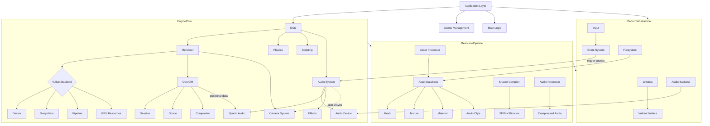
```mermaid
graph TD
    A[Application Layer] --> B[ECS]
    A --> C[Scene Management]
    A --> D[Main Logic]

    subgraph EngineCore
        B --> E[Renderer]
        B --> F[Physics]
        B --> G[Scripting]
        B --> H[Audio System]
        
        E --> I{Vulkan Backend}
        E --> J{OpenXR Backend}
        E --> K[Camera System]
        
        I --> L[Device]
        I --> M[Swapchain]
        I --> N[Pipeline]
        I --> O[GPU Resources]
        
        J --> P[Session]
        J --> Q[Space]
        J --> R[Compositor]
        
        H --> S[Audio Device]
        H --> T[Spatial Audio]
        H --> U[Effects]
    end

    subgraph ResourcePipeline
        V[Asset Processor] --> W[Asset Database]
        W --> X[Mesh]
        W --> Y[Texture]
        W --> Z[Material]
        W --> AA[Audio Clips] 
        
        AB[Shader Compiler] --> AC[SPIR-V Binaries]
        AD[Audio Processor] --> AE[Compressed Audio]
    end

    subgraph PlatformAbstraction
        AF[Window] --> AG[Vulkan Surface]
        AH[Input] --> AI[Event System]
        AJ[Filesystem] --> W
        AK[Audio Backend] --> S
    end

A --> PlatformAbstraction
EngineCore --> ResourcePipeline
ResourcePipeline --> PlatformAbstraction

H -. spatial sync .-> K[Camera System]
J[OpenXR] -- positional data --> T[Spatial Audio]
AI[Event System] -- trigger sounds --> H
```

### 2.2 核心系统架构 (ECS + 子系统协调)

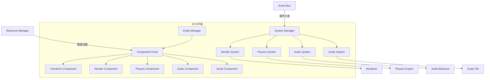
```mermaid
graph TD
    subgraph ECS中枢
        A[Entity Manager] --> B[Component Pools]
        B --> C[Transform Component]
        B --> D[Render Component]
        B --> E[Physics Component]
        B --> F[Audio Component]
        B --> G[Script Component]
        H[System Manager] --> I[Render System]
        H --> J[Physics System]
        H --> K[Audio System]
        H --> L[Script System]
    end
    
    I --> M[Renderer]
    J --> N[Physics Engine]
    K --> O[Audio Backend]
    L --> P[Script VM]
    
    Q[Event Bus] -->|事件分发| H
    R[Resource Manager] -->|数据加载| B
```

### 2.3 渲染系统架构 (Vulkan + OpenXR)

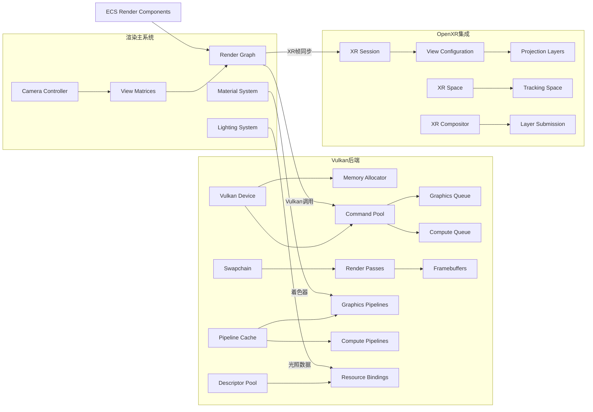
```mermaid
graph LR
    subgraph Vulkan后端
        A[Vulkan Device] --> B[Memory Allocator]
        A --> C[Command Pool]
        C --> D[Graphics Queue]
        C --> E[Compute Queue]
        F[Swapchain] --> G[Render Passes]
        G --> H[Framebuffers]
        I[Pipeline Cache] --> J[Graphics Pipelines]
        I --> K[Compute Pipelines]
        L[Descriptor Pool] --> M[Resource Bindings]
    end
    
    subgraph OpenXR集成
        N[XR Session] --> O[View Configuration]
        O --> P[Projection Layers]
        Q[XR Space] --> R[Tracking Space]
        S[XR Compositor] --> T[Layer Submission]
    end
    
    subgraph 渲染主系统
        U[Render Graph] -->|Vulkan调用| C
        U -->|XR帧同步| N
        V[Camera Controller] --> W[View Matrices]
        W --> U
        X[Material System] -->|着色器| J
        Y[Lighting System] -->|光照数据| M
    end
    
    Z[ECS Render Components] --> U
```

### 2.4 资源管理系统架构

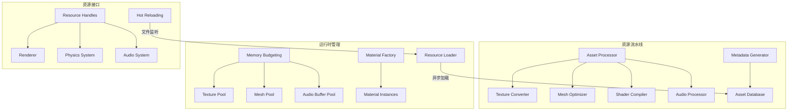
```mermaid
graph TB
    subgraph 资源流水线
        A[Asset Processor] --> B[Texture Converter]
        A --> C[Mesh Optimizer]
        A --> D[Shader Compiler]
        A --> E[Audio Processor]
        F[Metadata Generator] --> G[Asset Database]
    end
    
    subgraph 运行时管理
        H[Resource Loader] -->|异步加载| G
        I[Memory Budgeting] --> J[Texture Pool]
        I --> K[Mesh Pool]
        I --> L[Audio Buffer Pool]
        M[Material Factory] --> N[Material Instances]
    end
    
    subgraph 资源接口
        O[Resource Handles] --> P[Renderer]
        O --> Q[Physics System]
        O --> R[Audio System]
        S[Hot Reloading] -->|文件监听| H
    end
```

### 2.5 物理系统架构

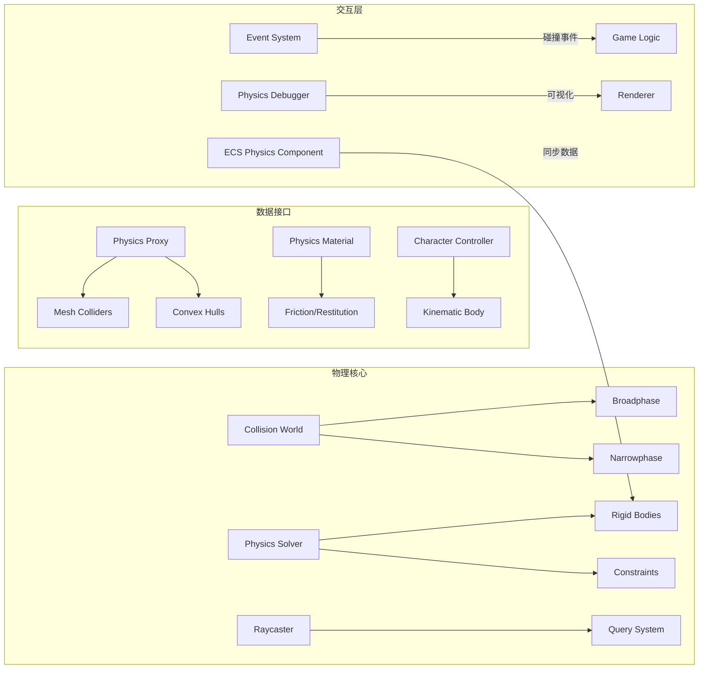
```mermaid
graph LR
    subgraph 物理核心
        A[Collision World] --> B[Broadphase]
        A --> C[Narrowphase]
        D[Physics Solver] --> E[Rigid Bodies]
        D --> F[Constraints]
        G[Raycaster] --> H[Query System]
    end

    subgraph 数据接口
        I[Physics Proxy] --> J[Mesh Colliders]
        I --> K[Convex Hulls]
        L[Physics Material] --> M[Friction/Restitution]
        N[Character Controller] --> O[Kinematic Body]
    end

subgraph 交互层
P[ECS Physics Component] -->|同步数据| E
Q[Event System] -->|碰撞事件| R[Game Logic]
S[Physics Debugger] -->|可视化| T[Renderer]
end
```

### 2.6 音频系统架构

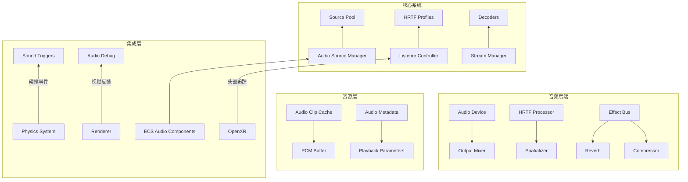
```mermaid
graph BT
    subgraph 音频后端
        A[Audio Device] --> B[Output Mixer]
        C[HRTF Processor] --> D[Spatializer]
        E[Effect Bus] --> F[Reverb]
        E --> G[Compressor]
    end
    
    subgraph 核心系统
        H[Audio Source Manager] --> I[Source Pool]
        J[Listener Controller] --> K[HRTF Profiles]
        L[Stream Manager] --> M[Decoders]
    end
    
    subgraph 资源层
        N[Audio Clip Cache] --> O[PCM Buffer]
        P[Audio Metadata] --> Q[Playback Parameters]
    end
    
    subgraph 集成层
        R[ECS Audio Components] --> H
        S[Physics System] -->|碰撞事件| T[Sound Triggers]
        U[OpenXR] -->|头部追踪| J
        V[Renderer] -->|视觉反馈| W[Audio Debug]
    end
```

### 2.7 平台抽象层架构

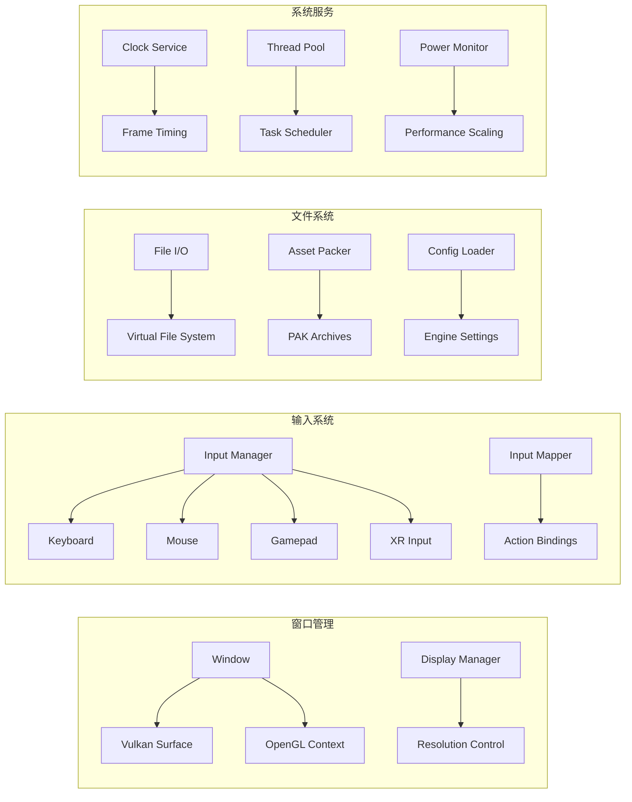
```mermaid
graph LR
    subgraph 窗口管理
        A[Window] --> B[Vulkan Surface]
        A --> C[OpenGL Context]
        D[Display Manager] --> E[Resolution Control]
    end
    
    subgraph 输入系统
        F[Input Manager] --> G[Keyboard]
        F --> H[Mouse]
        F --> I[Gamepad]
        F --> J[XR Input]
        K[Input Mapper] --> L[Action Bindings]
    end
    
    subgraph 文件系统
        M[File I/O] --> N[Virtual File System]
        O[Asset Packer] --> P[PAK Archives]
        Q[Config Loader] --> R[Engine Settings]
    end
    
    subgraph 系统服务
        S[Clock Service] --> T[Frame Timing]
        U[Thread Pool] --> V[Task Scheduler]
        W[Power Monitor] --> X[Performance Scaling]
    end
```

### 2.8 脚本系统架构

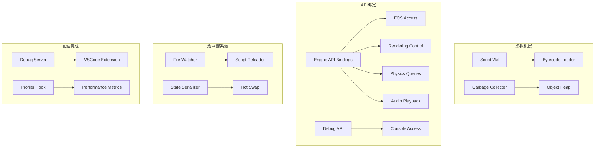
```mermaid
graph TD
    subgraph 虚拟机层
        A[Script VM] --> B[Bytecode Loader]
        C[Garbage Collector] --> D[Object Heap]
    end
    
    subgraph API绑定
        E[Engine API Bindings] --> F[ECS Access]
        E --> G[Rendering Control]
        E --> H[Physics Queries]
        E --> I[Audio Playback]
        J[Debug API] --> K[Console Access]
    end
    
    subgraph 热重载系统
        L[File Watcher] --> M[Script Reloader]
        N[State Serializer] --> O[Hot Swap]
    end
    
    subgraph IDE集成
        P[Debug Server] --> Q[VSCode Extension]
        R[Profiler Hook] --> S[Performance Metrics]
    end
```

### 2.9 模块交互关系图

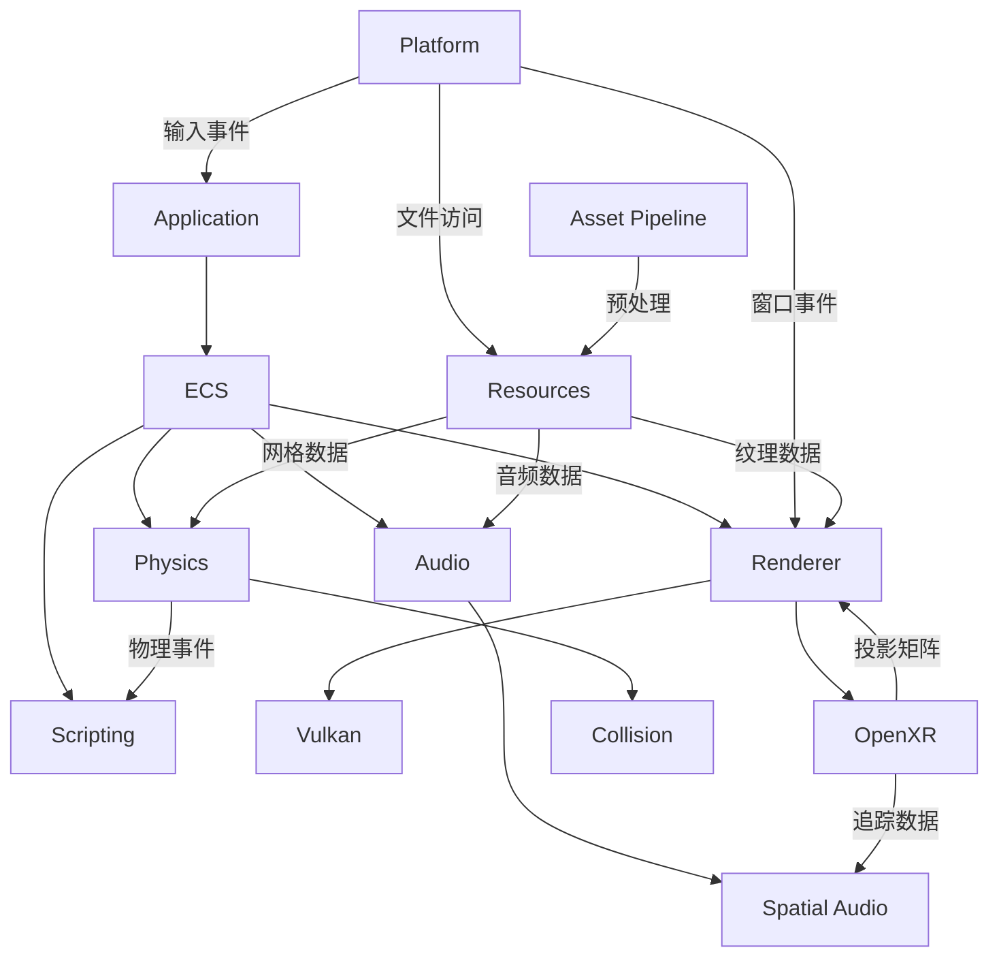
```mermaid
graph TD
    A[Application] --> B[ECS]
    B --> C[Renderer]
    B --> D[Physics]
    B --> E[Audio]
    B --> F[Scripting]
    
    C --> G[Vulkan]
    C --> H[OpenXR]
    
    D --> I[Collision]
    E --> J[Spatial Audio]
    
    K[Platform] -->|输入事件| A
    K -->|文件访问| L[Resources]
    K -->|窗口事件| C
    
    L -->|网格数据| D
    L -->|纹理数据| C
    L -->|音频数据| E
    
    M[Asset Pipeline] -->|预处理| L
    
    H -->|追踪数据| J
    H -->|投影矩阵| C
    
    D -->|物理事件| F
```

## 三、详细设计

### 3.1 ECS子系统

1. 详细架构图

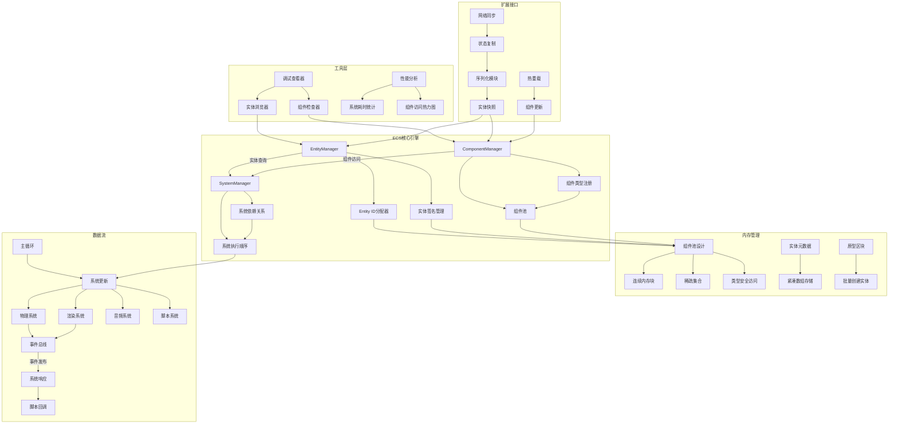
```mermaid
graph TD
    subgraph ECS核心引擎
        A[EntityManager] --> B[Entity ID分配器]
        A --> C[实体签名管理]
        D[ComponentManager] --> E[组件池]
        D --> F[组件类型注册]
        G[SystemManager] --> H[系统执行顺序]
        G --> I[系统依赖关系]

        A -->|实体查询| G
        D -->|组件访问| G
    end

    subgraph 内存管理
        J[组件池设计] --> K[连续内存块]
        J --> L[稀疏集合]
        J --> M[类型安全访问]
        N[实体元数据] --> O[紧凑数组存储]
        P[原型区块] --> Q[批量创建实体]
    end

    subgraph 数据流
        R[主循环] --> S[系统更新]
        S --> T[物理系统]
        S --> U[渲染系统]
        S --> V[音频系统]
        S --> W[脚本系统]
        X[事件总线] -->|事件发布| Y[系统响应]
        Y --> Z[脚本回调]
    end

    subgraph 工具层
        AA[调试查看器] --> AB[实体浏览器]
        AA --> AC[组件检查器]
        AD[性能分析] --> AE[系统耗时统计]
        AD --> AF[组件访问热力图]
    end

    subgraph 扩展接口
        AG[序列化模块] --> AH[实体快照]
        AI[网络同步] --> AJ[状态复制]
        AK[热重载] --> AL[组件更新]
    end

%% 连接关系
    B --> J
    C --> J
    E --> J
    F --> E
    H --> S
    I --> H
    T --> X
    U --> X
    AB --> A
    AC --> D
    AH --> A
    AH --> D
    AJ --> AG
    AL --> D
```

2. ECS核心类图

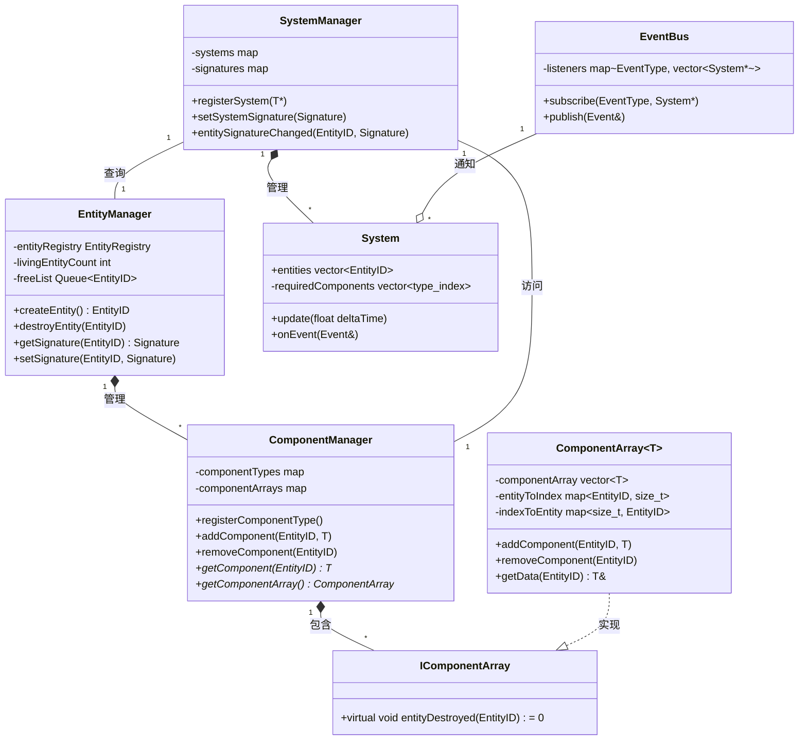
```mermaid
classDiagram
    class EntityManager {
        +createEntity() EntityID
        +destroyEntity(EntityID)
        +getSignature(EntityID) Signature
        +setSignature(EntityID, Signature)
        -entityRegistry EntityRegistry
        -livingEntityCount int
        -freeList Queue~EntityID~
    }
    
    class ComponentManager {
        +registerComponentType<T>()
        +addComponent<T>(EntityID, T)
        +removeComponent<T>(EntityID)
        +getComponent<T>(EntityID) T*
        +getComponentArray<T>() ComponentArray<T>*
        -componentTypes map<type_index, ComponentTypeInfo>
        -componentArrays map<type_index, IComponentArray*>
    }
    
    class SystemManager {
        +registerSystem<T>(T*)
        +setSystemSignature<T>(Signature)
        +entitySignatureChanged(EntityID, Signature)
        -systems map<type_index, ISystem*>
        -signatures map<type_index, Signature>
    }
    
    class System {
        +update(float deltaTime)
        +entities vector~EntityID~
        +onEvent(Event&)
        -requiredComponents vector~type_index~
    }
    
    class IComponentArray {
        +virtual void entityDestroyed(EntityID) = 0
    }
    
    class ComponentArray~T~ {
        +addComponent(EntityID, T)
        +removeComponent(EntityID)
        +getData(EntityID) T&
        -componentArray vector~T~
        -entityToIndex map~EntityID, size_t~
        -indexToEntity map~size_t, EntityID~
    }
    
    class EventBus {
        +subscribe(EventType, System*)
        +publish(Event&)
        -listeners map~EventType, vector~System*~~
    }
    
    EntityManager "1" *-- "*" ComponentManager : 管理
    SystemManager "1" *-- "*" System : 管理
    SystemManager "1" -- "1" EntityManager : 查询
    SystemManager "1" -- "1" ComponentManager : 访问
    ComponentManager "1" *-- "*" IComponentArray : 包含
    ComponentArray~T~ ..|> IComponentArray : 实现
    EventBus "1" --o "*" System : 通知
```

3. ECS内存布局示意图

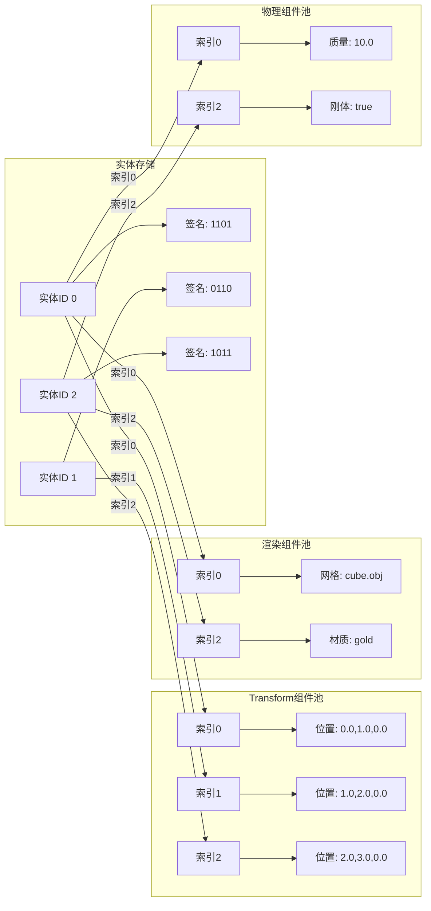
```mermaid
graph LR
    subgraph 实体存储
        A[实体ID 0] --> B[签名: 1101]
        C[实体ID 1] --> D[签名: 0110]
        E[实体ID 2] --> F[签名: 1011]
    end
    
    subgraph Transform组件池
        G[索引0] --> H[位置: 0.0,1.0,0.0]
        I[索引1] --> J[位置: 1.0,2.0,0.0]
        K[索引2] --> L[位置: 2.0,3.0,0.0]
    end
    
    subgraph 渲染组件池
        M[索引0] --> N[网格: cube.obj]
        O[索引2] --> P[材质: gold]
    end
    
    subgraph 物理组件池
        Q[索引0] --> R[质量: 10.0]
        S[索引2] --> T[刚体: true]
    end
    
    %% 映射关系
    A -->|索引0| G
    A -->|索引0| M
    A -->|索引0| Q
    
    C -->|索引1| I
    
    E -->|索引2| K
    E -->|索引2| O
    E -->|索引2| S
```

4. 系统执行流程图

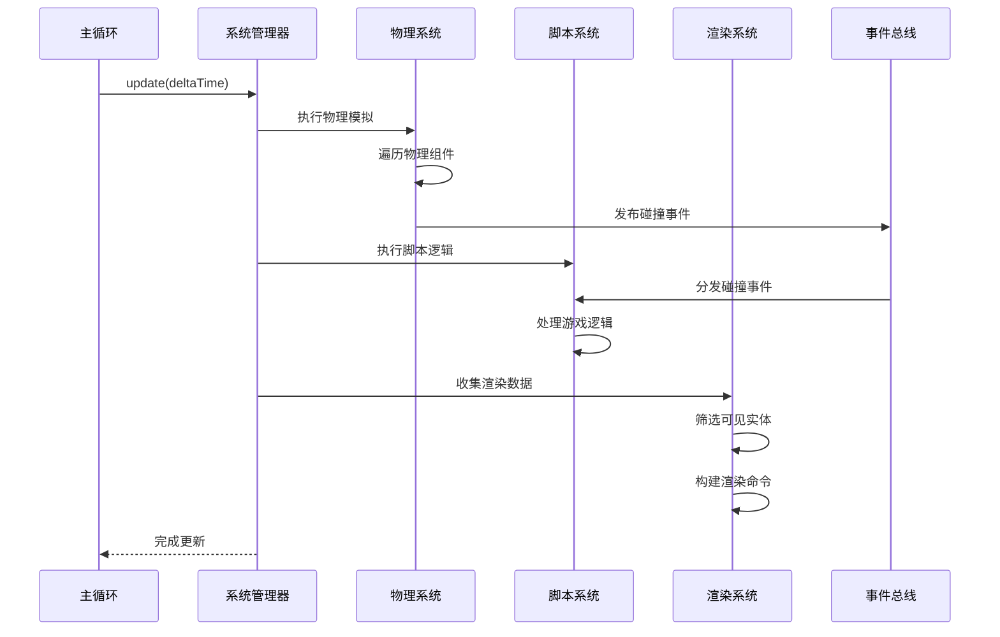
```mermaid
sequenceDiagram
    participant MainLoop as 主循环
    participant SystemMgr as 系统管理器
    participant PhysicsSys as 物理系统
    participant ScriptSys as 脚本系统
    participant RenderSys as 渲染系统
    participant EventBus as 事件总线
    
    MainLoop->>SystemMgr: update(deltaTime)
    
    SystemMgr->>PhysicsSys: 执行物理模拟
    PhysicsSys->>PhysicsSys: 遍历物理组件
    PhysicsSys->>EventBus: 发布碰撞事件
    
    SystemMgr->>ScriptSys: 执行脚本逻辑
    EventBus->>ScriptSys: 分发碰撞事件
    ScriptSys->>ScriptSys: 处理游戏逻辑
    
    SystemMgr->>RenderSys: 收集渲染数据
    RenderSys->>RenderSys: 筛选可见实体
    RenderSys->>RenderSys: 构建渲染命令
    
    SystemMgr-->>MainLoop: 完成更新
```

5. 关键设计细节

- 组件存储优化
    ```c++
    // 使用稀疏集实现组件存储
    template<typename T>
    class ComponentArray {
        std::vector<T> denseArray;  // 紧凑存储
        std::unordered_map<EntityID, size_t> entityToIndex;
        std::unordered_map<size_t, EntityID> indexToEntity;
    };
    ```
- 实体查询优化
    ```mermaid
    graph LR
        A[系统签名] --> B[实体签名]
        B --> C[位掩码与运算]
        D[结果==系统签名] -->|匹配| E[加入系统实体列表]
    ```
- 事件系统设计
    ```c++
    struct CollisionEvent : public Event {
        EntityID entityA;
        EntityID entityB;
        glm::vec3 impactPoint;
    };
    
    // 系统注册事件
    physicsSystem->subscribe(EventType::Collision);
    
    // 事件发布
    EventBus::publish(CollisionEvent{e1, e2, point});
    ```
- 原型实体创建
    ```mermaid
    flowchart TB
        A[定义实体原型] --> B[包含组件集合]
        C[批量创建] --> D[复制原型组件]
        E[内存预分配] --> F[减少碎片]
    ```


### 3.2 渲染系统

#### 3.2.1 整体架构概述

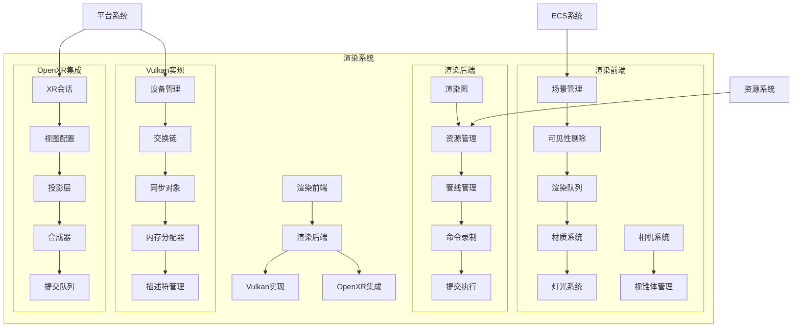
```mermaid
graph TD
    subgraph 渲染系统
        A[渲染前端] --> B[渲染后端]
        B --> C[Vulkan实现]
        B --> D[OpenXR集成]
        
        subgraph 渲染前端
            A1[场景管理] --> A2[可见性剔除]
            A2 --> A3[渲染队列]
            A3 --> A4[材质系统]
            A4 --> A5[灯光系统]
            A6[相机系统] --> A7[视锥体管理]
        end
        
        subgraph 渲染后端
            B1[渲染图] --> B2[资源管理]
            B2 --> B3[管线管理]
            B3 --> B4[命令录制]
            B4 --> B5[提交执行]
        end
        
        subgraph Vulkan实现
            C1[设备管理] --> C2[交换链]
            C2 --> C3[同步对象]
            C3 --> C4[内存分配器]
            C4 --> C5[描述符管理]
        end
        
        subgraph OpenXR集成
            D1[XR会话] --> D2[视图配置]
            D2 --> D3[投影层]
            D3 --> D4[合成器]
            D4 --> D5[提交队列]
        end
    end
    
    E[ECS系统] --> A1
    F[资源系统] --> B2
    G[平台系统] --> C1
    G --> D1
```

#### 3.2.2 详细模块设计

1. 渲染前端系统

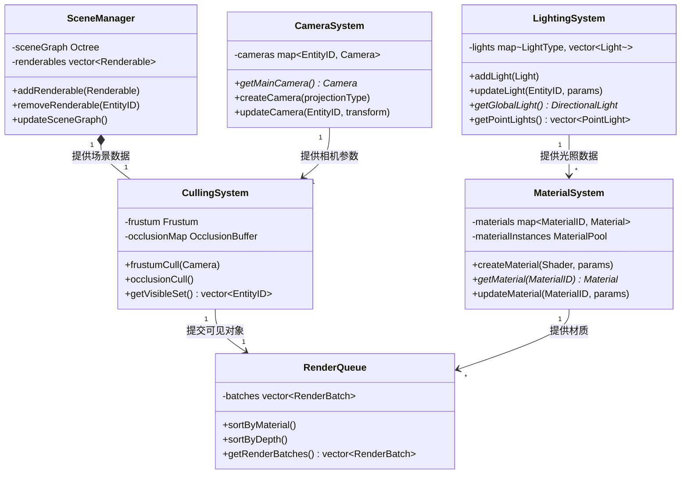
```mermaid
classDiagram
    class SceneManager {
        +addRenderable(Renderable)
        +removeRenderable(EntityID)
        +updateSceneGraph()
        -sceneGraph Octree
        -renderables vector~Renderable~
    }
    
    class CullingSystem {
        +frustumCull(Camera)
        +occlusionCull()
        +getVisibleSet() vector~EntityID~
        -frustum Frustum
        -occlusionMap OcclusionBuffer
    }
    
    class RenderQueue {
        +sortByMaterial()
        +sortByDepth()
        +getRenderBatches() vector~RenderBatch~
        -batches vector~RenderBatch~
    }
    
    class MaterialSystem {
        +createMaterial(Shader, params)
        +getMaterial(MaterialID) Material*
        +updateMaterial(MaterialID, params)
        -materials map~MaterialID, Material~
        -materialInstances MaterialPool
    }
    
    class LightingSystem {
        +addLight(Light)
        +updateLight(EntityID, params)
        +getGlobalLight() DirectionalLight*
        +getPointLights() vector~PointLight~
        -lights map~LightType, vector~Light~~
    }
    
    class CameraSystem {
        +getMainCamera() Camera*
        +createCamera(projectionType)
        +updateCamera(EntityID, transform)
        -cameras map~EntityID, Camera~
    }
    
    SceneManager "1" *-- "1" CullingSystem : 提供场景数据
    CullingSystem "1" --> "1" RenderQueue : 提交可见对象
    MaterialSystem "1" --> "*" RenderQueue : 提供材质
    LightingSystem "1" --> "*" MaterialSystem : 提供光照数据
    CameraSystem "1" --> "1" CullingSystem : 提供相机参数
```

2. 渲染后端系统

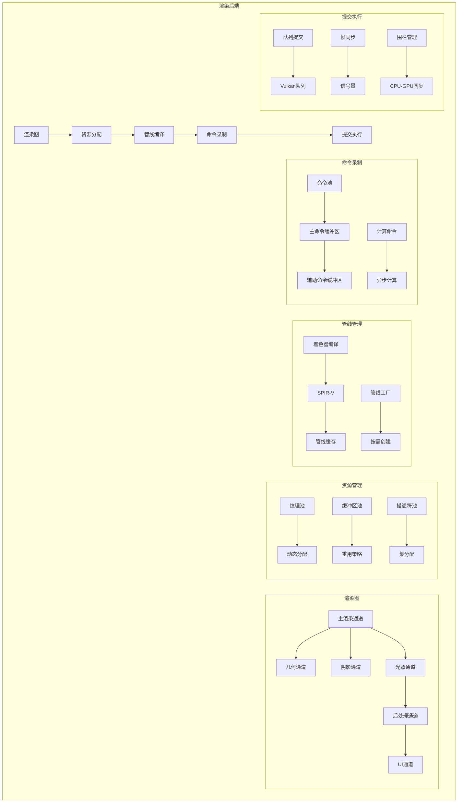
```mermaid
graph TD
    subgraph 渲染后端
        A[渲染图] --> B[资源分配]
        B --> C[管线编译]
        C --> D[命令录制]
        D --> E[提交执行]
        
        subgraph 渲染图
            A1[主渲染通道] --> A2[几何通道]
            A1 --> A3[阴影通道]
            A1 --> A4[光照通道]
            A4 --> A5[后处理通道]
            A5 --> A6[UI通道]
        end
        
        subgraph 资源管理
            B1[纹理池] --> B2[动态分配]
            B3[缓冲区池] --> B4[重用策略]
            B5[描述符池] --> B6[集分配]
        end
        
        subgraph 管线管理
            C1[着色器编译] --> C2[SPIR-V]
            C2 --> C3[管线缓存]
            C4[管线工厂] --> C5[按需创建]
        end
        
        subgraph 命令录制
            D1[命令池] --> D2[主命令缓冲区]
            D2 --> D3[辅助命令缓冲区]
            D4[计算命令] --> D5[异步计算]
        end
        
        subgraph 提交执行
            E1[队列提交] --> E2[Vulkan队列]
            E3[帧同步] --> E4[信号量]
            E5[围栏管理] --> E6[CPU-GPU同步]
        end
    end
```

3. Vulkan实现细节

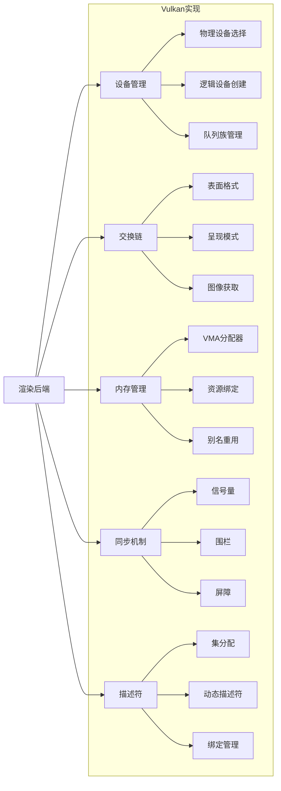
```mermaid
graph LR
    subgraph Vulkan实现
        A[设备管理] --> A1[物理设备选择]
        A --> A2[逻辑设备创建]
        A --> A3[队列族管理]
        
        B[交换链] --> B1[表面格式]
        B --> B2[呈现模式]
        B --> B3[图像获取]
        
        C[内存管理] --> C1[VMA分配器]
        C --> C2[资源绑定]
        C --> C3[别名重用]
        
        D[同步机制] --> D1[信号量]
        D --> D2[围栏]
        D --> D3[屏障]
        
        E[描述符] --> E1[集分配]
        E --> E2[动态描述符]
        E --> E3[绑定管理]
    end
    
    F[渲染后端] --> A
    F --> B
    F --> C
    F --> D
    F --> E
```

4. OpenXR集成设计

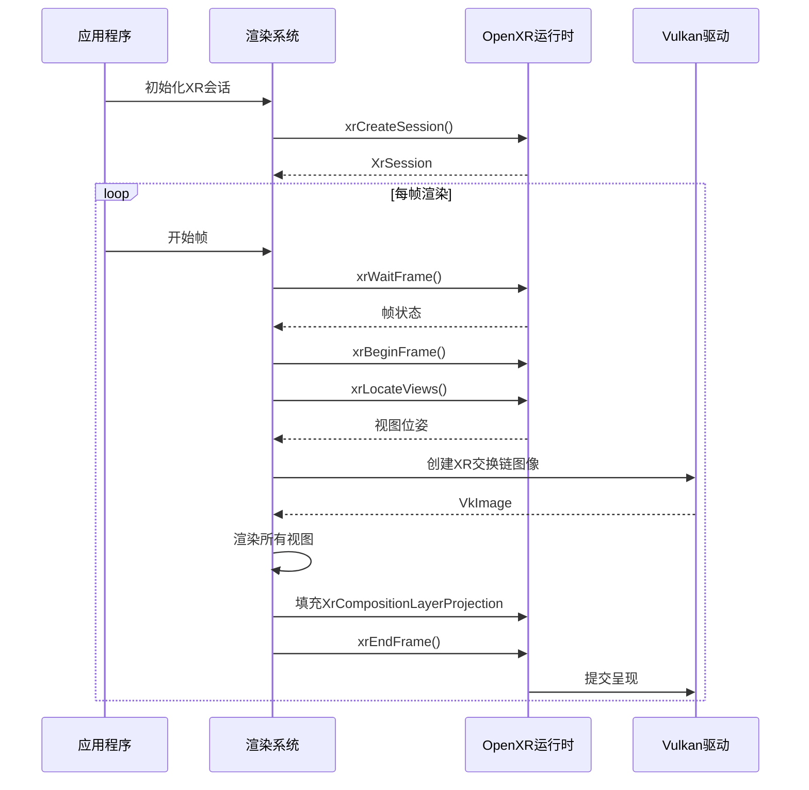
```mermaid
sequenceDiagram
    participant App as 应用程序
    participant Renderer as 渲染系统
    participant OpenXR as OpenXR运行时
    participant Vulkan as Vulkan驱动
    
    App->>Renderer: 初始化XR会话
    Renderer->>OpenXR: xrCreateSession()
    OpenXR-->>Renderer: XrSession
    
    loop 每帧渲染
        App->>Renderer: 开始帧
        Renderer->>OpenXR: xrWaitFrame()
        OpenXR-->>Renderer: 帧状态
        
        Renderer->>OpenXR: xrBeginFrame()
        
        Renderer->>OpenXR: xrLocateViews()
        OpenXR-->>Renderer: 视图位姿
        
        Renderer->>Vulkan: 创建XR交换链图像
        Vulkan-->>Renderer: VkImage
        
        Renderer->>Renderer: 渲染所有视图
        
        Renderer->>OpenXR: 填充XrCompositionLayerProjection
        Renderer->>OpenXR: xrEndFrame()
        OpenXR->>Vulkan: 提交呈现
    end
```

#### 3.2.3 渲染流程图

1. 主渲染流程

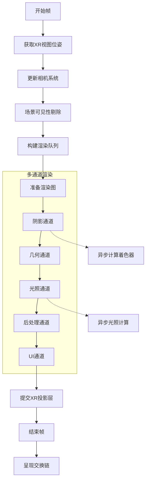
```mermaid
flowchart TB
    A[开始帧] --> B[获取XR视图位姿]
    B --> C[更新相机系统]
    C --> D[场景可见性剔除]
    D --> E[构建渲染队列]
    E --> F[准备渲染图]
    
    subgraph 多通道渲染
        F --> G[阴影通道]
        G --> H[几何通道]
        H --> I[光照通道]
        I --> J[后处理通道]
        J --> K[UI通道]
    end
    
    K --> L[提交XR投影层]
    L --> M[结束帧]
    M --> N[呈现交换链]
    
    %% 异步处理
    G -.-> O[异步计算着色器]
    I -.-> P[异步光照计算]
```

2. Vulkan命令录制流程

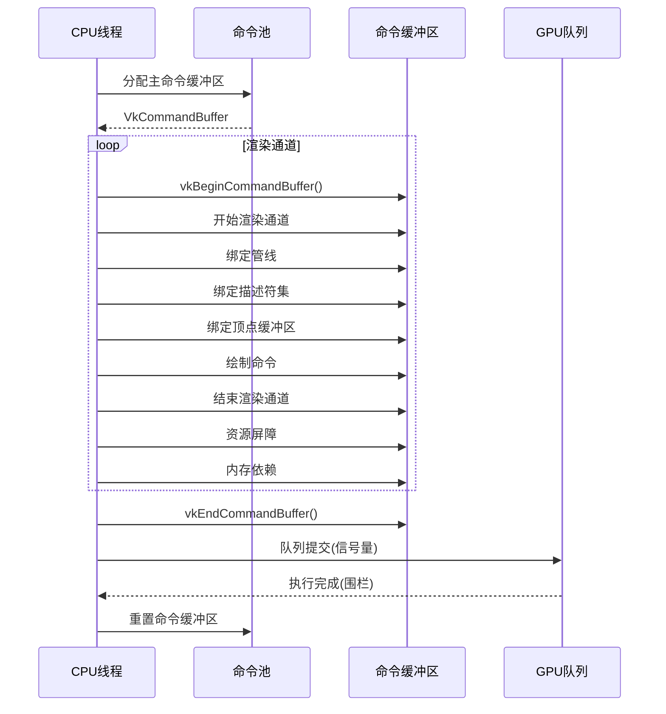
```mermaid
sequenceDiagram
    participant CPU as CPU线程
    participant CmdPool as 命令池
    participant CmdBuffer as 命令缓冲区
    participant GPU as GPU队列
    
    CPU->>CmdPool: 分配主命令缓冲区
    CmdPool-->>CPU: VkCommandBuffer
    
    loop 渲染通道
        CPU->>CmdBuffer: vkBeginCommandBuffer()
        
        CPU->>CmdBuffer: 开始渲染通道
        CPU->>CmdBuffer: 绑定管线
        CPU->>CmdBuffer: 绑定描述符集
        CPU->>CmdBuffer: 绑定顶点缓冲区
        CPU->>CmdBuffer: 绘制命令
        CPU->>CmdBuffer: 结束渲染通道
        
        CPU->>CmdBuffer: 资源屏障
        CPU->>CmdBuffer: 内存依赖
    end
    
    CPU->>CmdBuffer: vkEndCommandBuffer()
    
    CPU->>GPU: 队列提交(信号量)
    GPU-->>CPU: 执行完成(围栏)
    
    CPU->>CmdPool: 重置命令缓冲区
```


#### 3.2.4 关键数据结构设计

1. 渲染批处理结构

```c++
struct RenderBatch {
    MaterialID material;      // 材质标识
    PipelineID pipeline;      // 管线标识
    VkDescriptorSet descriptorSet; // 描述符集
    
    // 几何数据
    struct Geometry {
        MeshID mesh;
        uint32_t indexCount;
        uint32_t firstIndex;
        uint32_t vertexOffset;
    };
    
    std::vector<Geometry> geometries;
    std::vector<glm::mat4> transforms; // 实例化数据
};
```

2. 渲染图节点设计

```mermaid
classDiagram
    class RenderGraphNode {
        +string name
        +vector~ResourceID~ inputs
        +vector~ResourceID~ outputs
        +vector~RenderGraphNode~ dependencies
        +virtual void setup() = 0
        +virtual void execute(VkCommandBuffer) = 0
    }
    
    class GeometryNode {
        +RenderQueue* renderQueue
        +void execute(VkCommandBuffer cmd) override
    }
    
    class LightingNode {
        +LightingSystem* lightingSystem
        +ShadowMap* shadowMap
        +void execute(VkCommandBuffer cmd) override
    }
    
    class PostProcessNode {
        +PostEffect effect
        +void execute(VkCommandBuffer cmd) override
    }
    
    class PresentNode {
        +Swapchain* swapchain
        +void execute(VkCommandBuffer cmd) override
    }
    
    RenderGraphNode <|-- GeometryNode
    RenderGraphNode <|-- LightingNode
    RenderGraphNode <|-- PostProcessNode
    RenderGraphNode <|-- PresentNode
```

3. Vulkan资源管理

```mermaid
graph TB
    subgraph 资源池
        A[纹理池] --> A1[2D纹理]
        A --> A2[立方体贴图]
        A --> A3[3D纹理]
        
        B[缓冲区池] --> B1[顶点缓冲区]
        B --> B2[索引缓冲区]
        B --> B3[统一缓冲区]
        B --> B4[存储缓冲区]
        
        C[描述符池] --> C1[集分配]
        C --> C2[集重用]
        C --> C3[动态管理]
    end
    
    D[分配策略] --> D1[线性分配]
    D --> D2[伙伴系统]
    D --> D3[碎片整理]
    
    E[生命周期管理] --> E1[引用计数]
    E --> E2[延迟删除]
    
    F[渲染后端] --> A
    F --> B
    F --> C
    F --> D
    F --> E
```


#### 3.2.5 性能优化技术

1. 多线程渲染架构

```mermaid
graph TD
    subgraph 主线程
        A[应用逻辑] --> B[更新场景]
        B --> C[可见性剔除]
        C --> D[构建渲染队列]
    end
    
    subgraph 渲染线程
        E[等待帧开始] --> F[编译着色器]
        F --> G[更新资源]
        G --> H[录制命令]
        H --> I[提交队列]
    end
    
    subgraph 工作线程池
        J[几何处理] --> K[网格处理]
        L[纹理处理] --> M[Mipmap生成]
        N[光照计算] --> O[阴影图]
    end
    
    C -->|渲染数据| E
    I -->|呈现完成| A
    
    G --> J
    G --> L
    G --> N
```

2. GPU驱动优化

```mermaid
flowchart LR
    A[减少状态切换] --> B[管线排序]
    C[实例化渲染] --> D[合并绘制调用]
    E[间接绘制] --> F[GPU驱动]
    G[资源屏障优化] --> H[最小化同步]
    I[描述符重用] --> J[减少CPU开销]
    
    B --> F
    D --> F
    H --> F
    J --> F
```